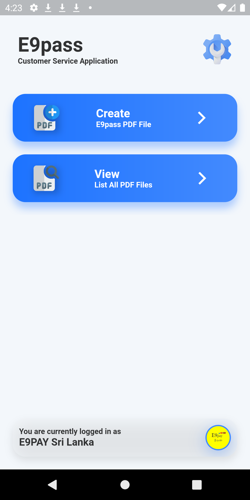
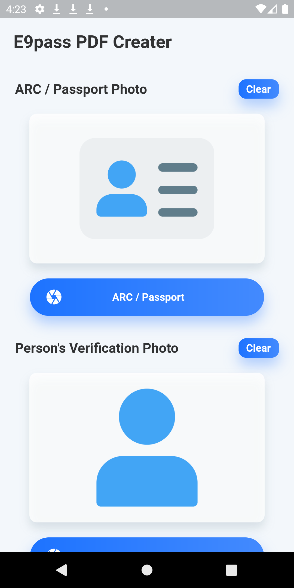

# E9pass CS

E9pass CS is a Flutter application use for make and save special format of pdf and photos to the device Download folder. This is currently only build for Android (SDK 21 < *).

* **PDF make** and **save** support.
* **QR Code** Reader.
* **Google Drive** Sync.
* **Google Sheet** Upload.

  
  
  
  

